# Node Js Learning

## Node Overview (client-server)

Will diagrams client-server interactions in a web application to highlight the area where Node operates.

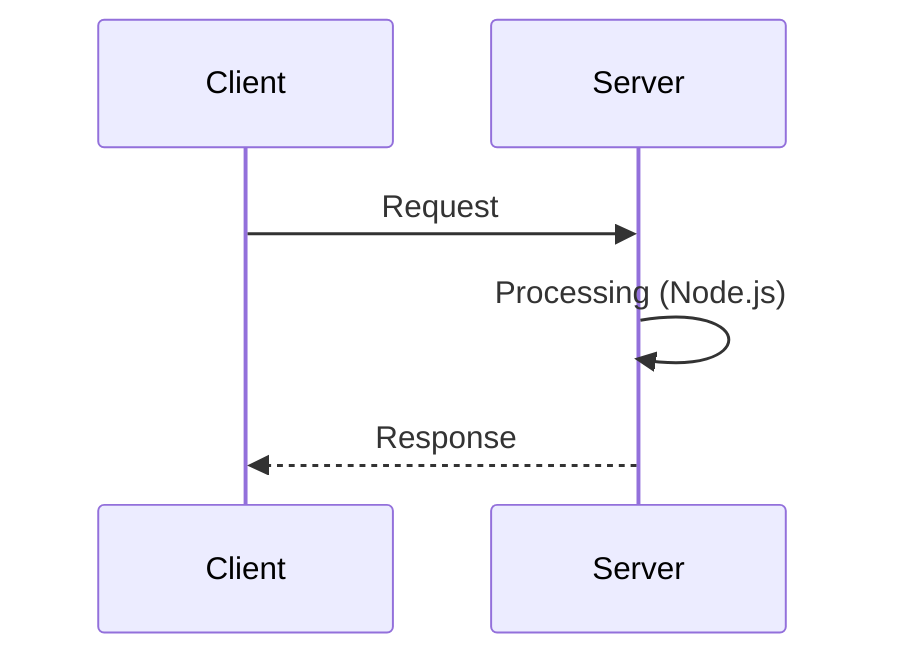

<h2 align="center"> OR</h2>

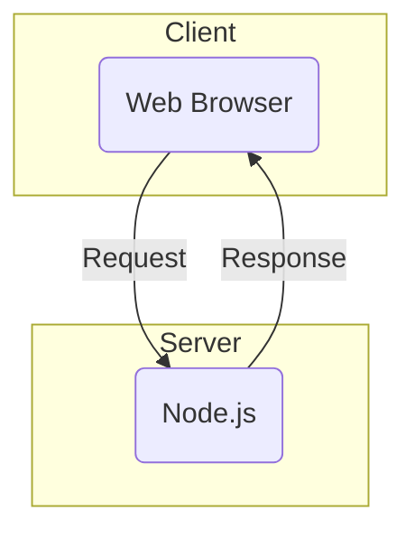

**In this Mermaid flowchart:**

- The client (browser) sends a request to the server.

- Node.js on the server processes the request.
- The server sends a response back to the client.
- Node.js is a JavaScript runtime environment that allows JavaScript to run on the server.
- Node.js is designed for asynchronous, non-blocking operations and building scalable servers.
- Node.js is event-driven, which means that everything that happens in Node is in reaction to an event.
- Node.js is single-threaded, which means that everything that happens in Node is run in a single thread.

---

## JavaScript, Node, and Computers

Will explains the role of JavaScript and Node within a server and differentiates between the two roles.
    
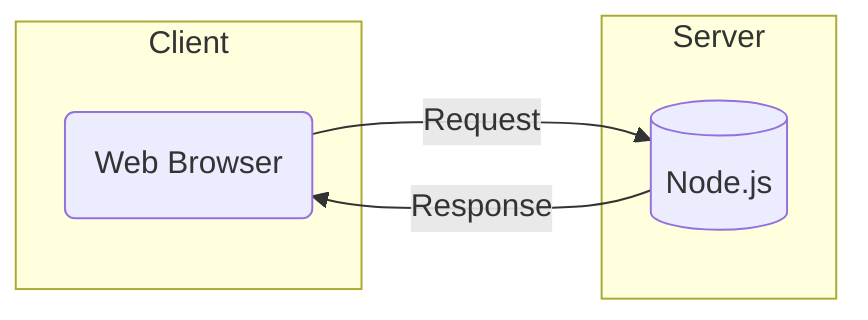

**Role of JavaScript on the Server**

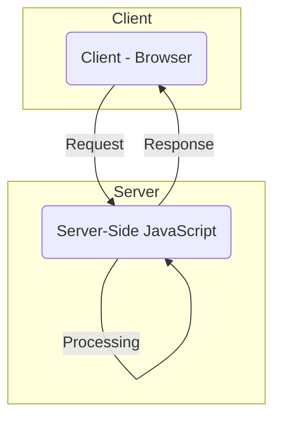

**In this Mermaid flowchart:**

- The client (browser) sends a request to the server.
- JavaScript on the server processes the request.
- The server sends a response back to the client.

### Role of Node.js on the Server:

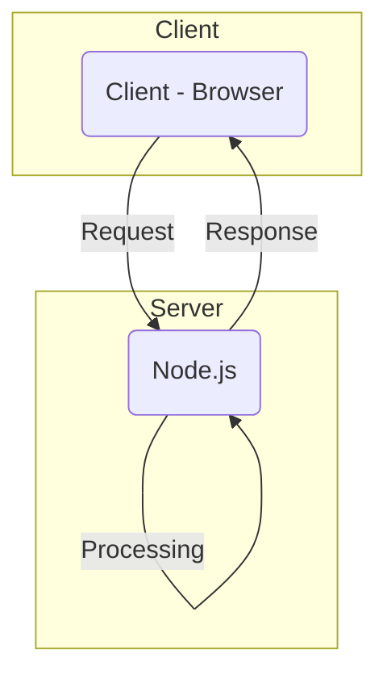

**In this Mermaid flowchart:**

- The client (browser) sends a request to the server.
- Node.js on the server processes the request.
- The server sends a response back to the client.

### Differentiation:

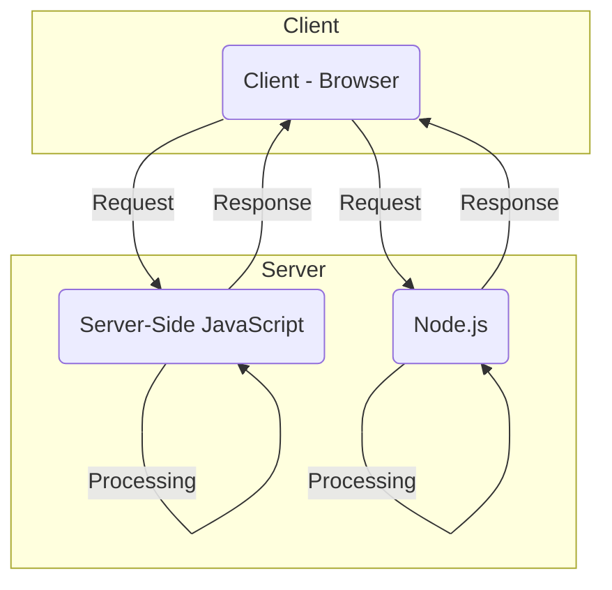

<h2 align="center"> OR</h2>

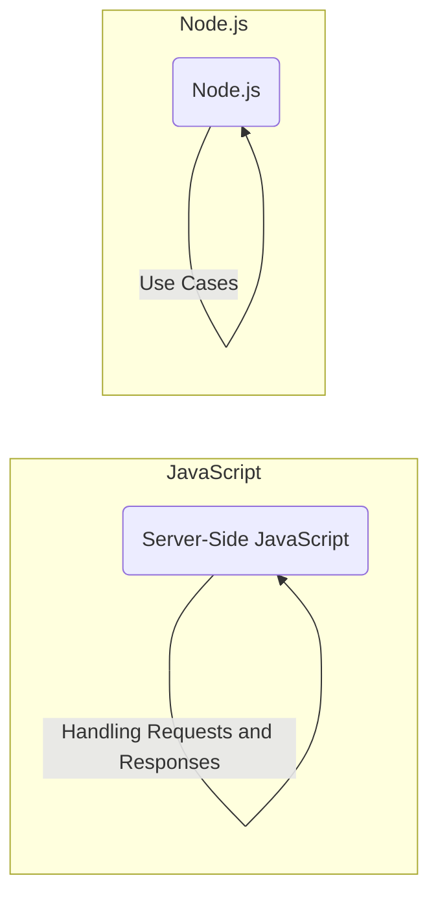

<h2 align="center"> OR</h2>

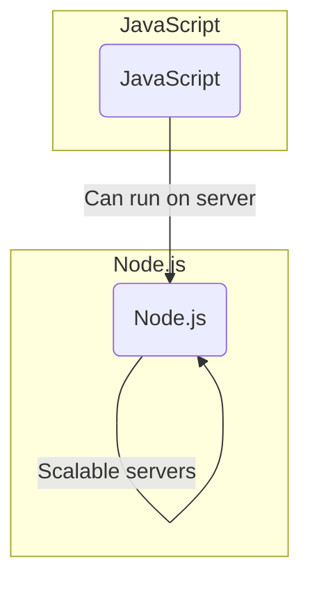

**In this Mermaid flowchart:**

- JavaScript can run in various environments, including servers.
- Node.js is a specific runtime environment for server-side JavaScript.
- Node.js is designed for asynchronous, non-blocking operations and building scalable servers.

---

## Executing JavaScript code review

Will demonstrates how to execute JavaScript code in the terminal using the Node REPL (Read-Eval-Print-Loop).

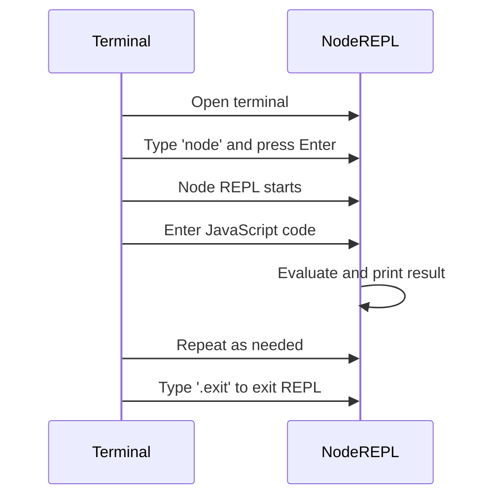

<h2 align="center"> OR</h2>

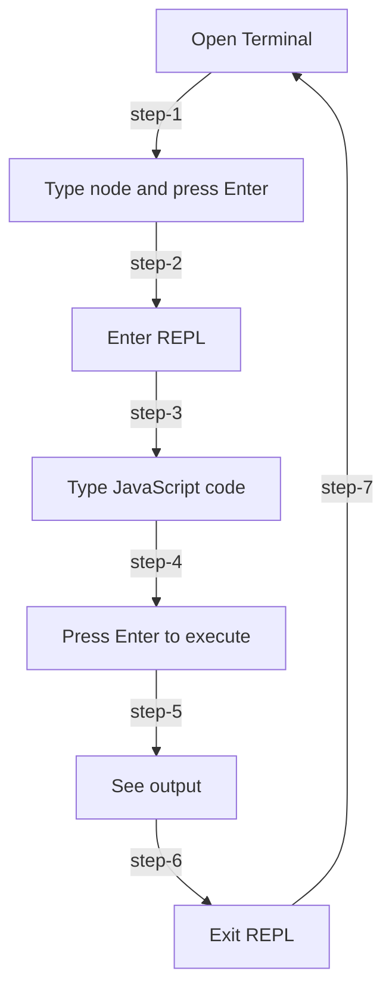

Explanation:

1. **Open Terminal**: Open your terminal or command prompt.

2. **Type "node" and press Enter**: Launch the Node.js environment in the terminal by typing "node" and pressing Enter.

3. **Enter REPL**: You will enter the Node REPL (Read-Eval-Print-Loop), indicated by the continuation of the flow.

4. **Type JavaScript code**: Input your JavaScript code directly into the REPL.

5. **Press Enter to execute**: Execute the entered JavaScript code by pressing Enter.

6. **See output**: View the output generated by the executed code.

7. **Exit REPL**: If you want to exit the Node REPL, type `.exit` or press `Ctrl + C` twice.

This flowchart provides a step-by-step guide for executing JavaScript code in the Node REPL in the terminal. Adjustments can be made based on specific needs or additional details.

---

Will walks line by line through the execution of code in JavaScript to demonstrate what is going on under the hood.

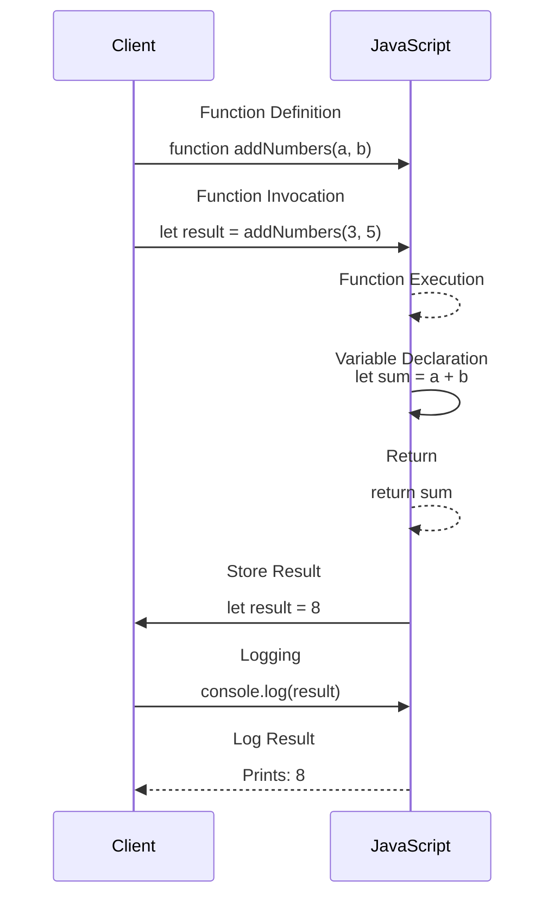

**The diagram shows the flow of execution:**

1. The client sends a function definition to JavaScript.
2. The client invokes the function with arguments.
3. JavaScript executes the function, involving variable declaration, addition operation, and return statement.
4. The result is stored in the client.
5. The client logs the result to the console.

---

## Executing Node.js code

Will discusses how Node is able to talk with the inner features of the server computer to enable network communication.

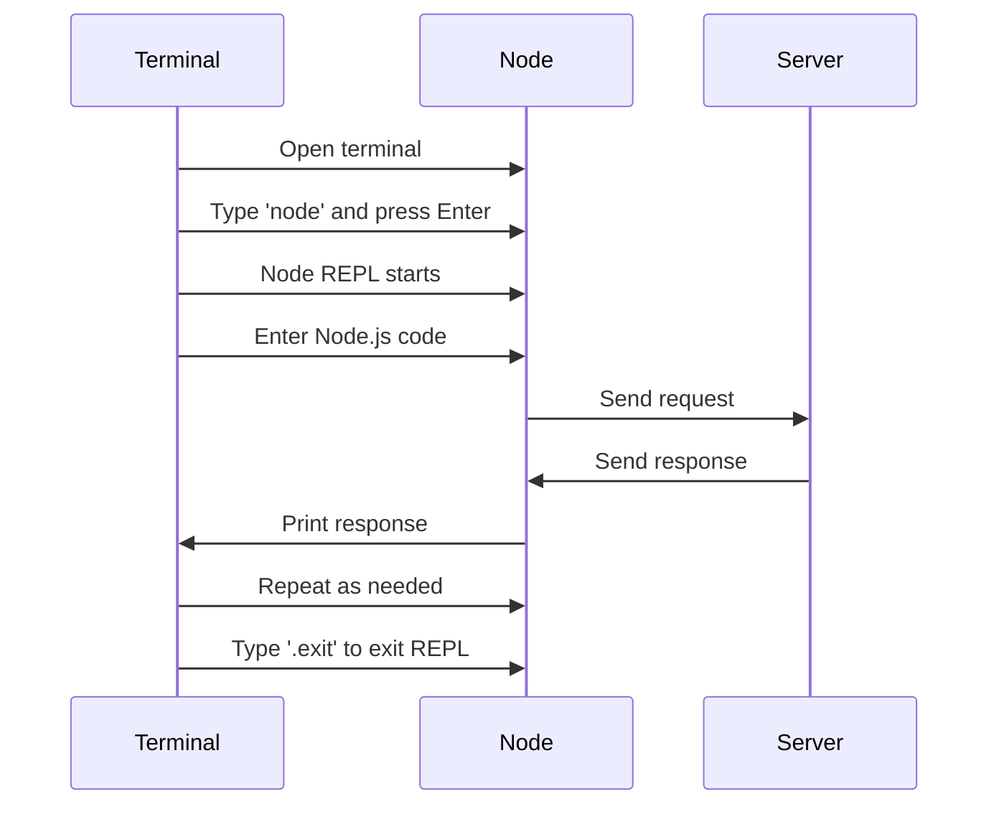

<h2 align="center"> OR</h2>

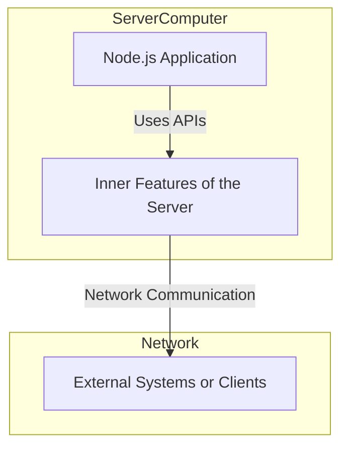

**Explanation:**

- **Node.js Application** communicates with the `Inner Features of the Server using APIs`. This represents how Node.js interacts with the underlying system resources and features.

- The interaction with the inner features of the server enables `Network Communication` with external systems or clients. This is where Node.js leverages its event-driven, non-blocking I/O model to efficiently handle multiple network requests.

- The arrows in the flowchart indicate the flow of communication from the Node.js application to the inner features of the server and, subsequently, to external systems or clients.

<h2 align="center"> OR</h2>

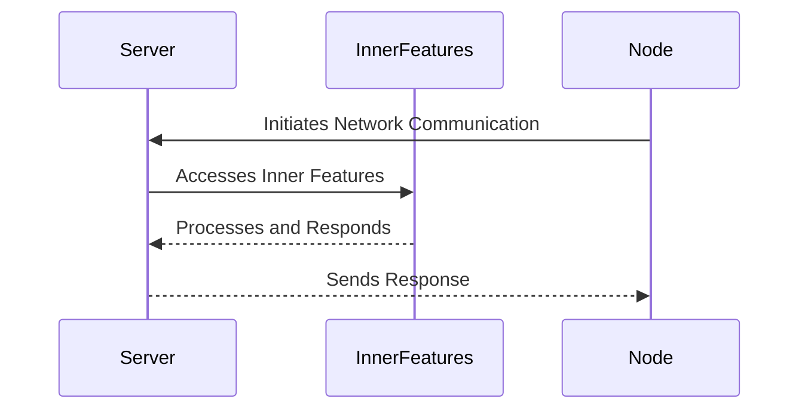

**Explanation:**

- **Initiation:** Node initiates network communication with the server.

- **Access Inner Features:** The server (S) utilizes its inner features to handle the incoming network communication.

- **Processing and Response:** The inner features process the request, and the server sends a response.

- **Response to Node.js:** The server sends the processed response back to Node, completing the communication.

---

